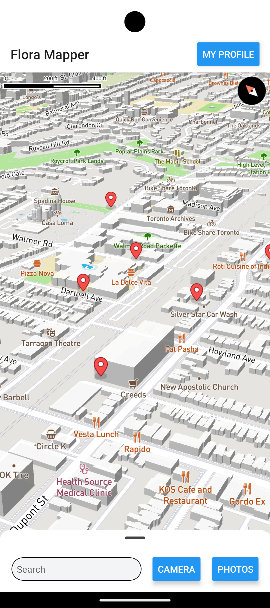
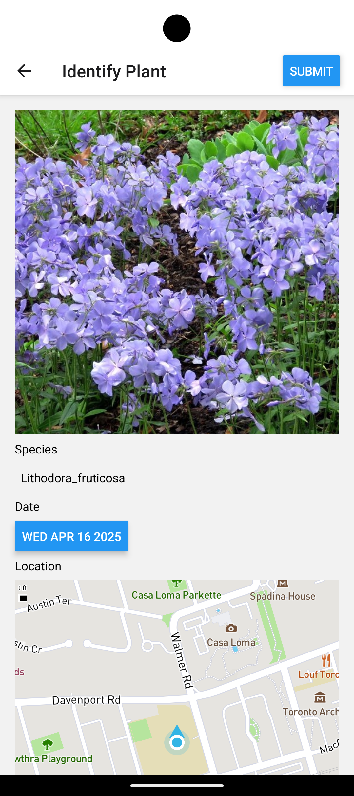
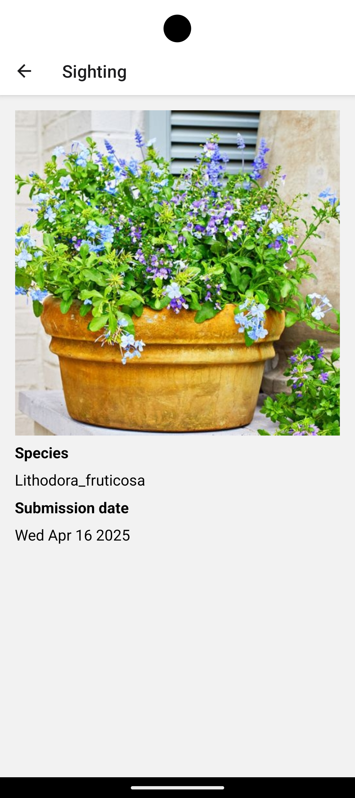

# Flora Mapper
## Summary
Flora Mapper allows users to see the species of any flower or leaf plant by taking a picture.

We use React Native as front end and FastAPI as backend. For plant detection and classification, we use ResNet to classify images sent from the app.

When a plant is recognized and classified, the app also allows the user to submit their sighting to the app,
so that users can build a crowd-sourced database of all the plant species in their neighbourhood/city.
All user submissions are displayed as icons on a 3D map on the app's home page.

## Screenshots
Map:

Identifying a plant from a photo:

Example of user submission:

